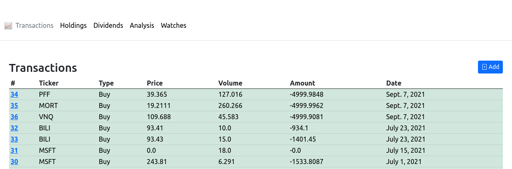

# Investat

A django-framework self-hosted invest statistics tool. Works well in analysis index-based investments.  
Another automate productivity work.  
## How to install
~~~bash
$ pip install -r requirements.txt
$ cd investat
$ python manage.py makemigrations
$ python manage.py migreate
~~~
## Run
Before using runserver command, please enable the cronjob for quoting live index values.
~~~
$ python manage.py crontab add

# adding cronjob: (6e8ef8ab1a45b4f6f0f9d192c1b0ed1c) -> ('* */1 * * *', 'analysis.live_quote.quote_live_price')

$ python manage.py runserver 8000
~~~

## Screenshot
